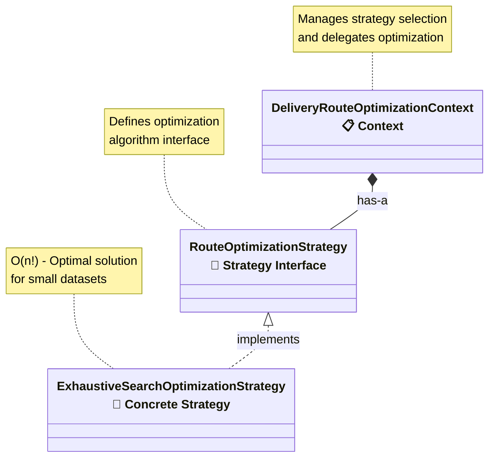
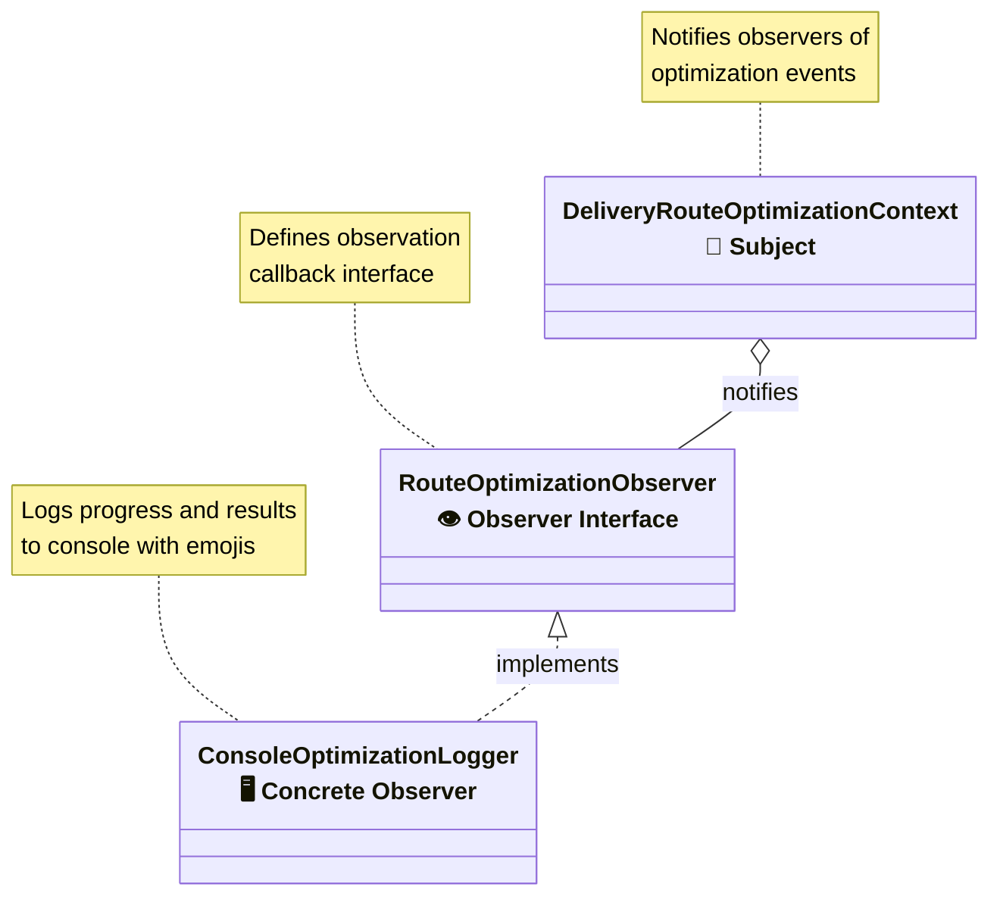
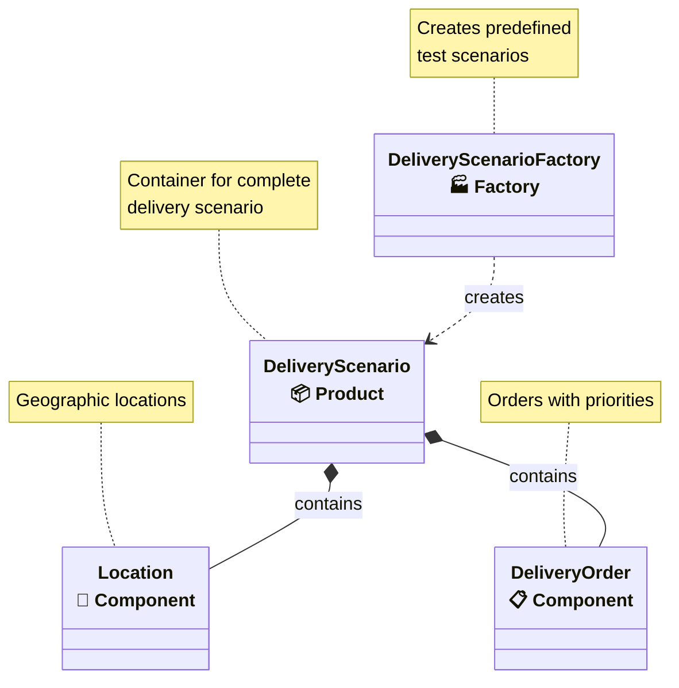
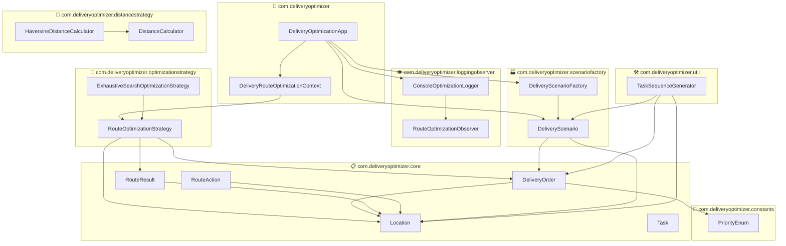

# 🏗️ Delivery Route Optimization System - Detailed Class Relationship Diagram

## 📊 UML Class Diagram with Relationships

```mermaid
classDiagram
    %% Domain Entities
    class Location {
        -String name
        -String address
        -double latitude
        -double longitude
        +Location(String, String, double, double)
        +Location(double, double, String)
        +String getName()
        +String getAddress()
        +String getId()
        +double getLatitude()
        +double getLongitude()
        +boolean equals(Object)
        +int hashCode()
        +String toString()
    }

    class DeliveryOrder {
        -String orderId
        -Location restaurantLocation
        -Location consumerLocation
        -int preparationTimeMinutes
        -PriorityEnum priority
        +DeliveryOrder(String, Location, Location, int, PriorityEnum)
        +DeliveryOrder(String, Location, Location, int)
        +String getOrderId()
        +Location getRestaurantLocation()
        +Location getConsumerLocation()
        +Location getRestaurant()
        +Location getConsumer()
        +int getPreparationTimeMinutes()
        +PriorityEnum getPriority()
        +boolean equals(Object)
        +int hashCode()
        +String toString()
    }

    class PriorityEnum {
        <<enumeration>>
        LOW
        MEDIUM
        HIGH
        -int weight
        +int getWeight()
        +String toString()
    }

    class RouteResult {
        -List~String~ route
        -double totalTimeMinutes
        -String strategy
        -List~String~ stepByStepActions
        +RouteResult(List~String~, double, String)
        +RouteResult(List~String~, double, String, List~String~)
        +List~String~ getRoute()
        +double getTotalTimeMinutes()
        +String getStrategy()
        +List~String~ getStepByStepActions()
        +String getRouteAsString()
        +void addAction(String)
        +String toString()
    }

    class RouteAction {
        -String actionType
        -String description
        -double timeAtAction
        -Location currentLocation
        +RouteAction(String, String, double, Location)
        +String getActionType()
        +String getDescription()
        +double getTimeAtAction()
        +Location getCurrentLocation()
        +String toString()
    }

    class Task {
        -int orderIndex
        -boolean isPickup
        -Location location
        +Task(int, boolean, Location)
        +int getOrderIndex()
        +boolean isPickup()
        +Location getLocation()
        +String toString()
    }

    %% Strategy Pattern
    class RouteOptimizationStrategy {
        <<interface>>
        +RouteResult optimizeRoute(Location, List~DeliveryOrder~, DistanceCalculator, double)
        +String getStrategyName()
    }


    class ExhaustiveSearchOptimizationStrategy {
        +RouteResult optimizeRoute(Location, List~DeliveryOrder~, DistanceCalculator, double)
        +String getStrategyName()
    }

    class GreedyNearestNeighborStrategy {
        +RouteResult optimizeRoute(Location, List~DeliveryOrder~, DistanceCalculator, double)
        +String getStrategyName()
    }

    class PriorityBasedOptimizationStrategy {
        +RouteResult optimizeRoute(Location, List~DeliveryOrder~, DistanceCalculator, double)
        +String getStrategyName()
    }

    %% Calculator Strategy Pattern
    class DistanceCalculator {
        <<interface>>
        +double calculateDistance(Location, Location)
        +double calculateTravelTime(Location, Location, double)
    }

    class HaversineDistanceCalculator {
        -double EARTH_RADIUS_KM
        +double calculateDistance(Location, Location)
    }

    %% Observer Pattern
    class RouteOptimizationObserver {
        <<interface>>
        +void onOptimizationStarted(String, int)
        +void onOptimizationCompleted(RouteResult)
        +void onProgressUpdate(String, double)
        +void onOptimizationError(String, Throwable)
    }

    class ConsoleOptimizationLogger {
        -boolean verboseMode
        +ConsoleOptimizationLogger()
        +ConsoleOptimizationLogger(boolean)
        +void onOptimizationStarted(String, int)
        +void onOptimizationCompleted(RouteResult)
        +void onProgressUpdate(String, double)
        +void onOptimizationError(String, Throwable)
        +void setVerboseMode(boolean)
    }

    %% Factory Pattern
    class DeliveryScenario {
        -String scenarioName
        -Location startLocation
        -List~DeliveryOrder~ orders
        +DeliveryScenario(String, Location, List~DeliveryOrder~)
        +DeliveryScenario(String, Location, DeliveryOrder[])
        +String getName()
        +Location getStartLocation()
        +List~DeliveryOrder~ getOrders()
        +int getOrderCount()
        +String toString()
    }

    class DeliveryScenarioFactory {
        <<utility>>
        +DeliveryScenario createBasicScenario()
        +DeliveryScenario createComplexScenario()
        +DeliveryScenario createEdgeCaseScenario()
        +DeliveryScenario createPerformanceTestScenario()
    }

    %% Context and App Classes
    class DeliveryRouteOptimizationContext {
        -RouteOptimizationStrategy optimizationStrategy
        -DistanceCalculator distanceCalculator
        -double averageSpeedKmh
        -List~RouteOptimizationObserver~ observers
        +DeliveryRouteOptimizationContext()
        +DeliveryRouteOptimizationContext(RouteOptimizationStrategy, DistanceCalculator, double)
        +void setOptimizationStrategy(RouteOptimizationStrategy)
        +void setDistanceCalculator(DistanceCalculator)
        +void setAverageSpeedKmh(double)
        +void addObserver(RouteOptimizationObserver)
        +void removeObserver(RouteOptimizationObserver)
        +RouteResult optimizeRoute(Location, List~DeliveryOrder~)
        +List~RouteResult~ compareOptimizationStrategies(Location, List~DeliveryOrder~)
        +RouteResult findBestRoute(Location, List~DeliveryOrder~)
        +double calculateRouteDistance(Location, List~DeliveryOrder~, List~String~)
    }

    class DeliveryOptimizationApp {
        +void main(String[])
    }

    %% Relationships
    
    %% Composition and Aggregation
    DeliveryOrder *-- PriorityEnum : priority
    DeliveryOrder *-- Location : restaurantLocation
    DeliveryOrder *-- Location : consumerLocation
    RouteAction *-- Location : currentLocation
    DeliveryScenario *-- Location : startLocation
    DeliveryScenario o-- DeliveryOrder : orders
    DeliveryRouteOptimizationContext *-- RouteOptimizationStrategy : optimizationStrategy
    DeliveryRouteOptimizationContext *-- DistanceCalculator : distanceCalculator
    DeliveryRouteOptimizationContext o-- RouteOptimizationObserver : observers

    %% Strategy Pattern Implementation

    RouteOptimizationStrategy <|.. ExhaustiveSearchOptimizationStrategy : implements
    RouteOptimizationStrategy <|.. GreedyNearestNeighborStrategy : implements
    RouteOptimizationStrategy <|.. PriorityBasedOptimizationStrategy : implements
    DistanceCalculator <|.. HaversineDistanceCalculator : implements

    %% Observer Pattern Implementation
    RouteOptimizationObserver <|.. ConsoleOptimizationLogger : implements

    %% Dependencies and Usage
    ExhaustiveSearchOptimizationStrategy ..> Location : uses
    ExhaustiveSearchOptimizationStrategy ..> DeliveryOrder : uses
    ExhaustiveSearchOptimizationStrategy ..> RouteResult : creates
    ExhaustiveSearchOptimizationStrategy ..> DistanceCalculator : uses

    HaversineDistanceCalculator ..> Location : uses

    DeliveryScenarioFactory ..> DeliveryScenario : creates
    DeliveryScenarioFactory ..> Location : creates
    DeliveryScenarioFactory ..> DeliveryOrder : creates

    DeliveryOptimizationApp ..> DeliveryRouteOptimizationContext : uses
    DeliveryOptimizationApp ..> DeliveryScenario : uses
    DeliveryOptimizationApp ..> DeliveryScenarioFactory : uses
    DeliveryOptimizationApp ..> ConsoleOptimizationLogger : uses
    DeliveryOptimizationApp ..> HaversineDistanceCalculator : uses

    ConsoleOptimizationLogger ..> RouteResult : uses

    %% Return types
    RouteOptimizationStrategy ..> RouteResult : returns
    DeliveryRouteOptimizationContext ..> RouteResult : returns
```

## 🎯 Design Pattern Relationships

### 1. **Strategy Pattern** 

### 2. **Observer Pattern**

### 3. **Factory Pattern**

## 📊 Package Structure & Dependencies

## 🔍 Detailed Class Interactions

### Core Execution Flow:
1. **Main** → delegates to **DeliveryOptimizationApp**
2. **DeliveryOptimizationApp** → creates scenarios via **DeliveryScenarioFactory**
3. **DeliveryOptimizationApp** → uses **DeliveryRouteOptimizerContext** with different strategies
4. **DeliveryRouteOptimizerContext** → delegates to **RouteOptimizationStrategy** implementations
5. **Strategy implementations** → use **DistanceCalculator** and create **RouteResult**
6. **ConsoleOptimizationLogger** → observes and logs optimization events

### Key Relationships:
- **Composition**: Strong ownership (filled diamond ♦)
- **Aggregation**: Weak ownership (empty diamond ◇)  
- **Implementation**: Interface implementation (dashed line with triangle ⟨⟩)
- **Dependency**: Uses/creates (dashed arrow →)
- **Association**: Direct relationship (solid line —)

This diagram shows the complete architecture with all design patterns, inheritance relationships, dependencies, and data flow through the system! 🎉
